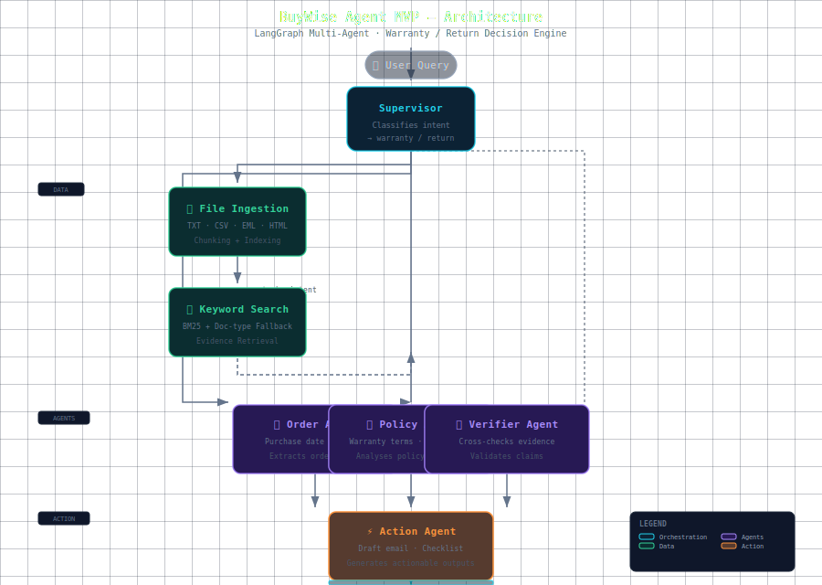

# BuyWise Agent MVP 🤖🛒

**A LangGraph multi-agent RAG assistant for warranty/return decisions — local-first, demo-ready.**

---

## 🎯 What It Does

Upload a receipt + warranty card + policy → ask "can I still return/warranty this?" → system runs 4 agents to produce an evidence-backed answer with action drafts.

**This is the MVP (Minimum Viable Product).** It covers the **warranty/return** decision scenario end-to-end. Price monitoring, review summarization, and async workers are planned for later phases (see Roadmap).

## 🧠 Architecture (MVP)



## 🚀 Quickstart

```bash
# 1. Install (MVP core deps only)
pip install -e ".[dev]"

# 2. Run the warranty demo
make demo

# 3. Try the laptop return case
make demo-laptop

# 4. Run eval (2 cases, 4 metrics)
make eval

# 5. Start FastAPI server
make dev
```

## 📸 Demo Output

```
  BuyWise Agent MVP — Warranty/Return Demo

  📄 Source: headphone_warranty_case/
  💬 Query:  My headphones stopped charging after 7 months.
             Can I claim warranty?

  ────────────────────────────────────────────────────────
  📊 ANALYSIS RESULT
  ────────────────────────────────────────────────────────
  Intent:        warranty_or_return
  Evidence used: 6 chunks
  Confidence:    1.0

  📋 Key Facts:
    ⚠️  [0.9] Intent classified as: warranty_or_return
    ✅ [0.6] Purchase date: 2025-11-10
    ✅ [0.7] Warranty period: 1 year

  📝 Suggested Actions:
    🔓 [draft_email] Draft return/refund request to merchant
    🔓 [export_report] Collect these items before contacting support
```

## 📡 API Usage

### POST `/api/chat`

```bash
curl -X POST http://localhost:8000/api/chat \
  -H "Content-Type: application/json" \
  -d '{
    "query": "My headphones stopped charging after 7 months. Can I claim warranty?",
    "source_dirs": ["sample_data/headphone_warranty_case"]
  }'
```

**Response (JSON):**

```json
{
  "status": "complete",
  "intent": "warranty_or_return",
  "summary": "Your product appears to be within the warranty period. You can file a warranty claim.",
  "key_facts": [
    {
      "text": "Purchase date: 2025-11-10",
      "confidence": 0.6,
      "supported": true
    },
    {
      "text": "Warranty period: 1 year",
      "confidence": 0.7,
      "supported": true
    }
  ],
  "actions": [
    {
      "action_id": "act_warranty_claim",
      "type": "draft_email",
      "description": "Draft warranty claim email to merchant",
      "requires_approval": false
    }
  ],
  "evidence_count": 6,
  "confidence": 1.0
}
```

### GET `/health`

```bash
curl http://localhost:8000/health
# {"status": "ok", "service": "buywise-agent-mvp"}
```

## 📊 Eval (current)

- **Evidence Recall**: 0.8 — 80% of gold keywords found in retrieved evidence
- **Forbidden Claim Avoidance**: 1.0 — no hallucinated claims
- **Action Generation**: 1.0 — expected action types all present
- **Confidence Reported**: 1.0 — confidence always populated

## 📁 Structure

```
buywise-agent/
├── agent/              # LangGraph workflow + 4 specialist agents
├── assets/             # Architecture diagram (SVG + HTML)
│   ├── graph.py        # 7-node graph with loop guard
│   ├── state.py        # Pydantic data models
│   └── agents/         # supervisor, order, policy, verifier, action
├── ingestion/parsers/  # File parsers (PDF, CSV, EML, HTML, TXT)
├── retrieval/          # Keyword search + rerank + compress
├── apps/api/           # FastAPI backend (2 endpoints)
├── eval/               # Eval suite (2 cases, 4 metrics)
├── sample_data/        # 2 synthetic demo cases
├── scripts/demo.py     # CLI demo runner
├── docker-compose.yml  # Full stack (PostgreSQL + Redis + API + Worker)
└── Makefile
```

## 🛣️ Roadmap (post-MVP)

- **Phase 4**: Full pgvector + BM25 hybrid retrieval → better evidence recall
- **Phase 5**: Price monitor + deadline watch agents → proactive alerts
- **Phase 6**: Async workers (Celery) + review summarization agent
- **Phase 7**: Web UI (Streamlit/Next.js) + real EML/PDF upload

To install extras for later phases:

```bash
# For vector DB / async workers (Phase 4+)
pip install -e ".[pgvector]"

# For advanced eval metrics (Phase 3+)
pip install -e ".[evalextra]"
```

## ⚠️ What This MVP Does NOT Do

- ❌ No multi-user / auth
- ❌ No real-time Gmail/Amazon integration
- ❌ No PostgreSQL/vector DB (runs with in-memory keyword search)
- ❌ No async background workers
- ❌ No price monitoring or review analysis
- ❌ No web frontend (API + CLI only)

All of these are scoped for post-MVP phases.

## ⚠️ Disclaimer

BuyWise Agent provides evidence-backed consumer suggestions, **not legal advice**. Users must review all drafts before acting.
