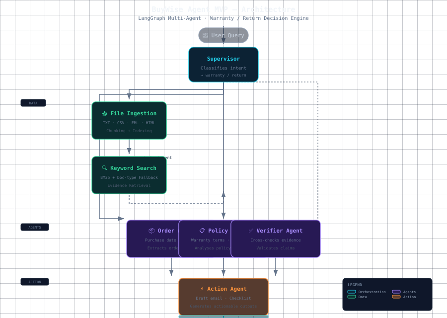

# BuyWise Agent MVP 🤖🛒

<p align="center">
  <a href="https://github.com/saltsalt123/buywise-agent/actions/workflows/ci.yml"></a>
  
  
  
  
  
  
  
  
</p>

**A LangGraph multi-agent RAG assistant for warranty/return decisions — local-first, demo-ready.**

---

## 🎯 What It Does

Upload a receipt + warranty card + policy → ask "can I still return/warranty this?" → system runs 4 agents to produce an evidence-backed answer with action drafts.

**This is the MVP (Minimum Viable Product).** It covers the **warranty/return** decision scenario end-to-end. Price monitoring, review summarization, and async workers are planned for later phases (see Roadmap).

## 🧠 Architecture (MVP)



## 🎬 Live Demo

[](https://asciinema.org/a/fEPSYmjBlaELIPjv)

*Click the image above to watch the interactive terminal demo — project structure overview + headphone warranty/return case run.*

## 🚀 Quickstart

```bash
# 1. Install (MVP core deps only). The Makefile uses $(PYTHON), which defaults to
#    `python3` — activate the venv so it resolves to the project interpreter, or
#    override per run: make demo PYTHON=python3.10
#    If `python3 -m venv` has no ensurepip (Debian/Ubuntu need python3-venv), the venv
#    comes out without pip and `source` fails — leaving pip to install globally. Use
#    `virtualenv .venv` instead, and check `which python3` points inside .venv.
python3 -m venv .venv && source .venv/bin/activate
pip install -e ".[dev]"

# 2. Run the test suite
make test
# The strict gate CI uses: fails on any skip or a shrunken suite
make test-ci

# 3. Run the warranty demo
make demo

# 4. Try the laptop return case
make demo-laptop

# 5. Run eval (2 positive cases x 4 metrics + 5 negative cases)
make eval

# 6. Start FastAPI server
make dev

# 7. (optional) Full stack: API + PostgreSQL + Redis via Docker
cp .env.example .env   # docker compose requires this file to exist
make up                # web UI (3000) is NOT included — see Roadmap Phase 7
```

## 📸 Demo Output

```
  BuyWise Agent MVP — Warranty/Return Demo

  📄 Source: headphone_warranty_case/
  💬 Query:  My headphones stopped charging after 7 months.
             Can I claim warranty?

  ────────────────────────────────────────────────────────
  📊 ANALYSIS RESULT
  ────────────────────────────────────────────────────────
  Intent:        warranty_or_return
  Evidence used: 15 chunks
  Confidence:    1.0

  📋 Key Facts:
    ⚠️  [0.9] Intent classified as: warranty_or_return
    ✅ [0.6] Purchase date: 2025-11-10
    ✅ [0.7] Warranty period: 1 year

  📝 Suggested Actions:
    🔓 [draft_email] Draft return/refund request to merchant
    🔓 [export_report] Collect these items before contacting support
```

## 📡 API Usage

### POST `/api/chat`

`source_dirs` entries must resolve inside `SAFE_SOURCE_ROOTS` (default:
`sample_data/`). Absolute paths, `..` traversal and symlinks that escape the allowed root
are refused with **400 before the workflow is entered** — the service will not read an
arbitrary path off the filesystem.

```bash
curl -X POST http://localhost:8000/api/chat \
  -H "Content-Type: application/json" \
  -d '{
    "query": "My headphones stopped charging after 7 months. Can I claim warranty?",
    "source_dirs": ["sample_data/headphone_warranty_case"]
  }'
```

```bash
# Refused: outside the allowed roots
curl -X POST http://localhost:8000/api/chat \
  -H "Content-Type: application/json" \
  -d '{"query": "x", "source_dirs": ["/tmp/loopcase"]}'
# 400 {"detail": "source_dirs entry '/tmp/loopcase' is outside the allowed roots (.../sample_data)"}
```

**Response (JSON)** — actual output for the request above:

```json
{
  "status": "complete",
  "intent": "warranty_or_return",
  "summary": "Your product is still within its warranty period, but the return window has closed. A warranty claim is the remaining option.",
  "key_facts": [
    {"text": "Purchase date: 2025-11-10", "confidence": 0.6, "supported": true},
    {"text": "Amount paid: $89.99", "confidence": 0.85, "supported": true},
    {"text": "Return window: 30 days (past window)", "confidence": 0.9, "supported": true},
    {"text": "The return window has closed", "confidence": 0.9, "supported": true},
    {"text": "Warranty period: 1 year", "confidence": 0.9, "supported": true}
  ],
  "actions": [
    {"action_id": "act_warranty_claim", "type": "draft_email",
     "description": "Draft warranty claim email to merchant/manufacturer",
     "requires_approval": false},
    {"action_id": "act_return_exception_request", "type": "draft_email",
     "description": "Draft an exception request — the return window has closed, so ask whether an exception is possible",
     "requires_approval": false},
    {"action_id": "act_checklist", "type": "export_report",
     "description": "Collect these items before contacting support:",
     "requires_approval": false}
  ],
  "evidence_count": 15,
  "confidence": 1.0
}
```

`confidence` is the share of claims the verifier could support
(`verified / (verified + unsupported)`). It is `0.0` when no claim is supported — a run
with no documents reports `status: "no_evidence"` and `confidence: 0.0`, never `1.0`.

`status` is one of `complete`, `needs_human_review` (the documents contradict each other),
`no_evidence`, `insufficient_evidence`, or `unsupported_intent` (a recognised but
unimplemented intent short-circuits).

### GET `/health`

```bash
curl http://localhost:8000/health
# {"status": "ok", "service": "buywise-agent-mvp"}
```

## 📊 Eval (current)

`make eval` runs two suites and reports them separately.

**Positive cases** (2 cases × 4 metrics) — both at 1.0:

- **Evidence Recall**: 1.0 — all gold keywords found in retrieved evidence
- **Forbidden Claim Avoidance**: 1.0 — no hallucinated claims
- **Action Generation**: 1.0 — expected action types all present
- **Confidence Reported**: 1.0 — confidence always populated

**Negative cases** (5) — each passes when the system *refuses* to answer as if it had
evidence. An eval that only prints "8/8" says nothing about whether the system knows when
to stop, so these are reported explicitly:

| case | what it pins down |
|---|---|
| `neg_001_no_documents_at_all` | empty source dir → `status=no_evidence`, no documents drafted, `confidence=0.0` |
| `neg_002_nothing_parsable` | dir with only `.bin`/`.png` → same |
| `neg_003_unimplemented_intent` | purchase query → `status=unsupported_intent`, no actions, no key facts |
| `neg_004_loop_guard_terminates` | unsupported claims → returns, `retrieval_attempts<=2`, no hang |
| `case_contradictory_policy` | receipt grants a 30-day window while the merchant's policy is final sale → `status=needs_human_review`, **no** `act_return_request`, conflict recorded, `confidence<=0.5`, summary explains the disagreement |

Results are written to `eval/reports/latest.md`.

## ✅ CI & Development checks

Every push to `main` and every pull request runs
[CI](https://github.com/saltsalt123/buywise-agent/actions/workflows/ci.yml) on **Python 3.10,
3.11 and 3.12**: lint, the strict test check, and the eval suite.

Recommended locally before pushing:

```bash
make lint       # ruff
make test-ci    # pytest, but a skip or a shrunken suite fails the run
make eval       # 2 positive cases x 4 metrics + 5 negative cases
```

`make test` is the everyday run — it reports skips and keeps going. `make test-ci` is the
gate: it fails if **any** test is skipped, and if the passing count falls below the expected
total (368). That strictness is not pedantry. A test-only dependency (`reportlab`) was
missing from the `dev` extra, its module-level `pytest.importorskip` turned fourteen
parser-robustness tests into one module skip, and the run reported
`353 passed, 1 skipped` with exit code 0 — a smaller suite wearing a green face. `make
test-ci` exists so that cannot happen again, in CI or on a laptop.

## 📁 Structure

```
buywise-agent/
├── agent/              # LangGraph workflow
│   ├── graph.py        # 7-node graph with loop guard
│   ├── state.py        # Pydantic data models
│   ├── textnorm.py     # Shared tokenising / stopwords / IDF
│   └── agents/         # supervisor + 5 specialists (order, policy, product, verifier, action)
├── assets/             # Architecture diagram (SVG + HTML)
├── ingestion/          # Doc parsing
│   ├── doc_type.py     # One place that decides what a document is
│   ├── parsers/        # File parsers (PDF, CSV, EML, HTML, TXT)
│   └── labels.py       # Label/value extraction
├── retrieval/          # IDF-weighted keyword search + rerank + compress
├── apps/api/           # FastAPI backend (2 endpoints, path whitelist on /api/chat)
├── eval/               # Eval suite (2 positive cases x 4 metrics + 5 negative cases)
├── tests/              # Pytest suite (368 tests)
├── sample_data/        # 3 synthetic demo cases
├── scripts/demo.py     # CLI demo runner
├── docker-compose.yml  # API + PostgreSQL + Redis (no web UI / worker — see Roadmap)
└── Makefile
```

## 🛣️ Roadmap (post-MVP)

- **Phase 4**: Full pgvector + BM25 hybrid retrieval. The in-memory retriever is still
  **lexical** and that is its ceiling: ranking is now IDF-weighted over content terms with
  stop-words removed and token-boundary matching (`agent/textnorm.py`), so filler can no
  longer outrank a policy sentence and `"i"` no longer matches every word containing it —
  but a chunk that shares no *content* term with the query still scores zero. Recall reads
  1.00: 0.60 → 0.90 came from raising the measured budget (`top_k=20 / max_chunks=15`), and
  the last 0.10 from correcting a gold keyword that never matched the data — the case asked
  for "May 15" while the files store ISO dates (`2026-05-15`). Embedding retrieval remains
  unimplemented; that is what would handle paraphrase and synonyms.
- **Phase 5**: Price monitor + deadline watch agents → proactive alerts
- **Phase 6**: Async workers (Celery) + review summarization agent
- **Phase 7**: Web UI (Streamlit/Next.js) + real EML/PDF upload
- **Phase 8**: Replace the keyword-based intent classifier with an LLM/embedding
  classifier. Substring matching cannot generalise — every inflection whose stem is
  respelled (`charging`, `broke`, `warranties`, `stopped working`) has to be listed by
  hand, and an unseen phrasing such as *"my phone just died"* still falls through to
  `general_qa`. The keyword list is a stop-gap, not a classifier.

To install extras for later phases:

```bash
# For vector DB / async workers (Phase 4+)
pip install -e ".[pgvector]"

# For advanced eval metrics (Phase 3+)
pip install -e ".[evalextra]"
```

## 🔧 Fixed in this round (P0/P1/P2 bug defence)

Each item below was reproduced by a failing test first, then fixed. The test file named in
each row is the regression guard.

| # | Defect (measured before the fix) | Fix | Guard |
|---|---|---|---|
| 1 | **Infinite loop.** `route_after_verify` re-entered `retrieve_evidence` whenever claims were unsupported, but only `ingest_and_index` incremented `retrieval_attempts` — and it runs once. The counter stayed at 1 forever and the workflow never returned. | the counter advances in `retrieve_evidence_node`; the cap is named `_MAX_RETRIEVAL_ATTEMPTS` | `test_workflow_loop_guard.py` |
| 2 | **Verifier rubber-stamp.** `elif claim.confidence >= 0.7: verified.append(claim)` verified confident claims with **no supporting chunk at all**. Support was also a substring count, so sharing `return`/`days` was enough. | support requires token-boundary content overlap, and a claim asserting a quantity must find that quantity in the evidence | `test_verifier_strictness.py` |
| 3 | **Timezone.** Return windows were counted with `datetime.utcnow()`, so between 00:00–08:00 Beijing the UTC date lags and a window that had just closed still read as open. | `policy_agent_now()` returns Beijing time; the day comes from the Asia/Shanghai calendar | `test_policy_timezone_boundary.py` |
| 4 | **Zero evidence looked like success.** With no documents: `status="complete"`, `overall_confidence=1.0`, and a drafted `act_return_request` — because the supervisor's own claim text (`"Intent classified as: warranty_or_return"`) contains the word "return" and was read as evidence. | the intent claim is excluded from evidence heuristics; no documents → `status="no_evidence"` and `confidence=0.0`; the status is no longer overwritten with `"complete"` | `test_zero_evidence_behavior.py` |
| 5 | **Filler outranked policy.** Ranking counted raw query tokens as substrings, so a chunk repeating `can/i/this/on/may` beat `"Return Window: 14 days from delivery"`, and `"i"` matched nearly any word. | IDF-weighted content-term ranking with stop-words and token boundaries; inclusion is unchanged so recall cannot shrink | `test_retrieval_stopwords.py` |
| 6 | **Arbitrary file read.** `POST /api/chat` passed `source_dirs` straight to the workflow, so a caller could have `/tmp`, `/etc` or a home directory parsed into the answer. | `SAFE_SOURCE_ROOTS` whitelist; resolved (symlinks + `..` collapsed) and refused with 400 **before** the workflow runs | `test_api_path_whitelist.py` |
| 7 | **Cross-request data leak.** The retriever was a module-level `_RETRIEVER` singleton, so two requests in flight shared one corpus — the second `index_chunks` overwrote the first, and the doc-type fallback reads `retriever._chunks`. | the index is created per run and carried on the state | `test_retriever_isolation.py`, `test_concurrent_requests.py` |
| 8 | **The verifier re-verified itself.** Its own message carries the claims it already judged, and on the second pass those were collected again — so every claim appeared twice in `unsupported_claims` and the uncertainties list repeated itself. | claims from `verifier_agent` messages are skipped when collecting | `test_golden_outputs.py` |
| 9 | **Contradictory documents were silently resolved.** A receipt granting a 30-day window plus a policy stating final sale produced a normal `act_return_request` — the workflow picked whichever document it read first. | return-refusal wording becomes a `policy_return_conflict` claim; the action agent then refuses the plain return request, reports `needs_human_review`, caps confidence at 0.5 and explains the disagreement | `test_golden_outputs.py`, eval `case_contradictory_policy` |
| 10 | **A plain-text policy was invisible.** `return_policy.txt` was inferred as `manual` from its filename alone, and `policy_agent` only reads `{warranty, policy, receipt}` — so the return policy was dropped from every decision while the run still reported success. | inference moved into one function (`ingestion/doc_type.py`) consulted by every parser: extension → filename → **content** → extension default. The `.txt` body is now decoded *before* the type is decided. | `test_doc_type_inference.py`, `test_text_policy_participation.py` |
| 11 | **A zero-day return window vanished.** `if decision.return_window_days:` is falsy for `0`, so "Return Policy: 0 days" — final sale stated in numbers — produced no window claim and no verdict at all. | the guard is `is not None`; a 0-day window is recorded, judged not-valid, and published as `policy_return_unavailable`, which routes to an exception request | `test_zero_day_return_window.py` |
| 12 | **Most refusal wordings were invisible.** Only 10 phrases were recognised, so "all sales are final", "not eligible for return", "clearance items cannot be returned", "exchange only" and "refunds are unavailable" read as a policy that says nothing about returns. | the refusal list covers plain, eligibility and exchange-only refusals; a refusal with a window is a conflict, a refusal alone is "returns unavailable" | `test_return_refusal_patterns.py` |

Suite: **368 tests** (94 pre-existing, all still passing; the rest added over three rounds).

Known limits, stated rather than hidden:

- Verification is **lexical**. It cannot catch a semantic contradiction between two claims
  that happen to use the same words, and a derived verdict ("The return window has closed")
  is accepted on the strength of the terms it shares with its source document. Contradictory
  *documents* are detected by explicit refusal wording, not by reasoning about the conflict.
- The refusal list is still a **phrase list**. A merchant who refuses a return in a wording
  nobody has written down yet will not be detected; the list is extended by test, one wording
  at a time.
- Return-window and warranty periods are counted in **whole days** from the purchase date
  (`days_since <= N`), so a "1 year" warranty is 365 days, not a calendar year.
- The `confidence` figure is a **claim-support ratio**, not a probability that the answer is
  right: `verified / (verified + unsupported)`. The conflict cap is a separate, explicit
  ceiling rather than something derived from the ratio.
- `retrieval_attempts` is a loop guard, not a quality gate — hitting the cap means "give the
  user the answer we have", not "the evidence is adequate".

## ⚠️ What This MVP Does NOT Do

- ❌ No multi-user / auth
- ❌ No real-time Gmail/Amazon integration
- ❌ No PostgreSQL/vector DB (runs with in-memory keyword search)
- ❌ No async background workers
- ❌ No purchase-decision flow (intent is detected, but returns `unsupported_intent`)
- ❌ No price monitoring or review analysis
- ❌ No web frontend (API + CLI only)

All of these are scoped for post-MVP phases.

## ⚠️ Disclaimer

BuyWise Agent provides evidence-backed consumer suggestions, **not legal advice**. Users must review all drafts before acting.
